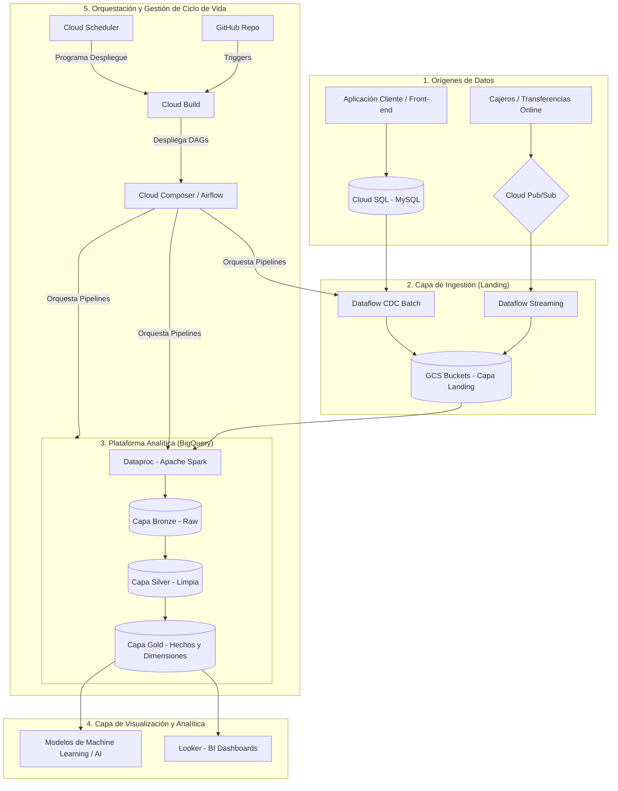
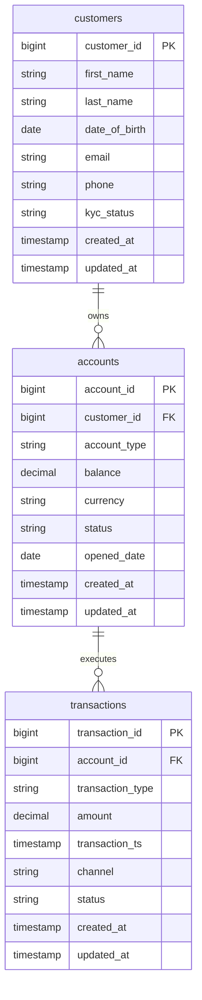

# 2. Project Introduction and Banking Data Platform Architecture

Este documento detalla la arquitectura de referencia, los flujos de datos paso a paso y la infraestructura de servicios para construir una **Plataforma de Datos Bancarios (Banking Analytics Platform)** utilizando Google Cloud Platform (GCP).

---

## 1. Introducción al Proyecto

El objetivo principal de este proyecto es construir una plataforma moderna de análisis y procesamiento de datos bancarios a gran escala. La plataforma está diseñada para resolver retos clave del sector financiero, tales como:
*   **Monitoreo y detección de fraudes:** Identificación en tiempo real de transacciones sospechosas.
*   **Fallas operacionales:** Identificación rápida de transacciones fallidas, pendientes o reversadas.
*   **Actualizaciones de saldos:** Procesamiento y visualización consolidada del estado financiero de los clientes.
*   **Reportes regulatorios y comerciales:** Generación automatizada de resúmenes diarios e información analítica a nivel de cliente para la toma de decisiones.

---

## 2. Fuentes de Datos y Modelo de Negocio Bancario

En un entorno real de banca, los datos se generan a partir de dos flujos principales:

### Fuente 1: Datos Operacionales (Procesamiento por Lotes / Batch CDC)
*   **Servicio en GCP:** **Cloud SQL** (motor de base de datos MySQL relacional).
*   **Origen:** Aplicaciones orientadas al cliente (Front-end), sistemas de sucursales y bases de datos transaccionales core.
*   **Entidades principales (Tablas de base de datos):** 
    *   `customers` (información KYC, datos demográficos, estados de clientes).
    *   `accounts` (saldos corrientes, tipos de cuentas, fechas de apertura).
    *   `transactions` (historial de transacciones de sucursales o batch).
*   **Rutas Relativas en el Proyecto:**
    *   **Directorio de la Base de Datos:** [cloudsql/](file:///c:/Repos/BK/banking-data-platform/cloudsql/)
    *   **Definición de Esquemas (DDL):** [cloudsql/ddl.sql](file:///c:/Repos/BK/banking-data-platform/cloudsql/ddl.sql)
    *   **Lotes de datos simulados:**
        *   [1.º Lote de Datos (Carga Inicial):](file:///c:/Repos/BK/banking-data-platform/cloudsql/1st_batch_data.sql) `cloudsql/1st_batch_data.sql`
        *   [2.º Lote de Datos (Carga Incremental):](file:///c:/Repos/BK/banking-data-platform/cloudsql/2nd_batch_data.sql) `cloudsql/2nd_batch_data.sql`
        *   [3.º Lote de Datos (Carga Incremental):](file:///c:/Repos/BK/banking-data-platform/cloudsql/3rd_batch_data.sql) `cloudsql/3rd_batch_data.sql`
    *   **Pipeline de Ingestión CDC (Dataflow / Apache Beam):** [airflow/data/dataflow/cloudsql_cdc_pipeline.py](file:///c:/Repos/BK/banking-data-platform/airflow/data/dataflow/cloudsql_cdc_pipeline.py)

### Fuente 2: Eventos de Transacciones en Tiempo Real (Streaming)
*   **Servicio en GCP:** **Cloud Pub/Sub**.
*   **Origen:** Interacciones rápidas como transacciones en cajeros automáticos (ATMs), transferencias interbancarias inmediatas, portales de pago móvil o transferencias mediante redes de pago rápido (UPI, transferencias en línea).
*   **Objetivo:** Capturar inmediatamente el evento de pago para alimentar alertas de fraude o actualización inmediata de saldos operacionales.
*   **Rutas Relativas en el Proyecto:**
    *   **Directorio del Productor:** [pubsub/](file:///c:/Repos/BK/banking-data-platform/pubsub/)
    *   **Simulador / Productor de Eventos:** [pubsub/banking_transaction_producer.py](file:///c:/Repos/BK/banking-data-platform/pubsub/banking_transaction_producer.py)
    *   **Pipeline de Ingestión Streaming (Dataflow / Apache Beam):** [airflow/data/dataflow/streaming_transactions_pipeline.py](file:///c:/Repos/BK/banking-data-platform/airflow/data/dataflow/streaming_transactions_pipeline.py)

---

## 3. Arquitectura del Sistema: Flujo de Datos Paso a Paso

A continuación se describe el recorrido que siguen los datos desde el momento en que se generan hasta que son consumidos por los usuarios finales y analistas de negocio:



### Paso 1: Generación y Transmisión del Dato
El cliente realiza una acción (abre una cuenta, actualiza KYC, efectúa un pago en línea, retira dinero en cajero). 
*   Si la acción se registra en la base de datos central de la banca, viaja a **Cloud SQL**.
*   Si es un evento transaccional rápido de tiempo real, se publica como un mensaje estructurado en **Cloud Pub/Sub**.

### Paso 2: Ingestión con Dataflow (Apache Beam) a la Capa Landing (GCS)
Para mover los datos al almacenamiento crudo sin bloquear los sistemas de producción:
*   Un pipeline de **Cloud Dataflow** (basado en Apache Beam) extrae los datos incrementales de Cloud SQL usando técnicas de Captura de Datos Cambiados (CDC).
*   Otro pipeline de **Dataflow** consume en tiempo real los mensajes de **Pub/Sub**.
*   Toda esta información se deposita en **Google Cloud Storage (GCS)**, clasificada en carpetas y almacenada en archivos estructurados y altamente eficientes como **Parquet**. Esta zona es llamada **Landing Layer (Capa de Aterrizaje)**.

### Paso 3: Carga y Procesamiento con Dataproc (Apache Spark)
*   Para estructurar los archivos de GCS en la base de datos analítica, se utiliza **Cloud Dataproc** ejecutando código en **Apache Spark**.
*   Este proceso transforma los archivos Parquet en tablas estructuradas dentro de la plataforma analítica.

### Paso 4: Arquitectura Medallion en BigQuery
Los datos se cargan y transforman dentro de **BigQuery** a través de tres capas lógicas para asegurar la calidad y consistencia:
1.  **Capa Bronze (Capa Base):** Mantiene la representación directa y cruda del origen de los datos con fines de auditoría y reprocesamiento.
2.  **Capa Silver (Capa Limpia):** Aplica reglas de calidad de datos, limpieza de valores vacíos, eliminación de duplicados e imputación de nulos (ej: reemplazo de nulos por `'Sin Asignar'`).
3.  **Capa Gold (Capa de Entrega / Modelo Dimensional):** Organiza la información en tablas de Hechos y Dimensiones listas para el negocio, manejando cambios históricos a través de dimensionamiento de tipo SCD Tipo 2 (Slowly Changing Dimensions).

### Paso 5: Orquestación con Cloud Composer (Apache Airflow)
*   **Cloud Composer** (servicio administrado de Apache Airflow en GCP) se encarga de coordinar la ejecución secuencial y el monitoreo de todos los componentes. 
*   Monitorea la llegada de datos, activa los trabajos de Dataflow y Dataproc, ejecuta los scripts SQL de BigQuery y controla las dependencias a través de matrices configurables.

### Paso 6: Integración Continua y Despliegue (CI/CD)
*   Toda la lógica de transformación SQL, pipelines de Spark y DAGs de Airflow se almacena en **GitHub**.
*   Ante un cambio, **Cloud Scheduler** y **Cloud Build** (el motor de CI/CD nativo de GCP) ejecutan el despliegue automático de los DAGs y dependencias en el entorno correspondiente de Cloud Composer.

### Paso 7: Consumo de Datos e Insights
Las tablas finales de la capa Gold son consultadas por herramientas de Inteligencia de Negocios (**Looker**) para dashboards financieros, o cargadas en entornos de analítica avanzada para entrenamiento de modelos de Machine Learning (ML) y algoritmos de Inteligencia Artificial (AI) orientados a fraude o segmentación de clientes.

---

## 4. Matriz de Servicios y Roles en la Arquitectura

| Servicio GCP | Rol en la Arquitectura | Tipo de Procesamiento | Descripción Técnica |
| :--- | :--- | :--- | :--- |
| **Cloud SQL (MySQL)** | Fuente de Datos 1 | Batch / Relacional | Base de datos operacional de banca que almacena tablas maestras de clientes y cuentas. |
| **Cloud Pub/Sub** | Fuente de Datos 2 | Streaming / Eventos | Message Broker distribuido para ingerir eventos rápidos (UPI, ATMs, portales de pago). |
| **Cloud Dataflow** | Motor de Ingestión | Apache Beam | Ejecuta la captura CDC en batch y lee flujos continuos en streaming para guardarlos en GCS. |
| **Cloud Storage (GCS)** | Capa Landing / Raw | Objeto de Archivos | Data Lake primario para almacenamiento a bajo costo de archivos temporales y Parquet. |
| **Cloud Dataproc** | Procesador de Datos | Apache Spark | Ejecuta tareas Spark para la estructuración y carga inicial de los archivos de GCS a BigQuery. |
| **BigQuery** | Data Warehouse / Analytics | SQL Motor ANSI | Almacena y procesa las transformaciones de las capas Bronze, Silver y Gold. |
| **Cloud Composer** | Orquestador de Flujos | Apache Airflow | Coordina las dependencias, tiempos de ejecución y alarmas de todo el datalake. |
| **Cloud Build / GitHub** | Pipelines de CI/CD | Automatización | Encargado del ciclo de despliegue continuo de los códigos fuente y configuración de DAGs. |
| **Cloud Scheduler** | Programador | Cron Trigger | Lanza ejecuciones y eventos periódicos de despliegue y control. |
| **Cloud Logging** | Monitoreo y Auditoría | Logs Centralizados | Captura eventos, errores y auditorías para soporte operacional. |
| **Looker / Vertex AI** | Capa de Consumo | BI, ML & AI | Tableros e informes ejecutivos de balance de cuentas, detección de fallas y fraude. |

---

## 5. Técnicas y Buenas Prácticas Clave Implementadas

El diseño de la plataforma bancaria contempla las siguientes mejores prácticas de ingeniería de datos:

1.  **Arquitectura Basada en Metadatos (Metadata-Driven):** Evita el acoplamiento rígido de código (*hardcoding*). Las dependencias de los DAGs y las tablas configuradas se gestionan dinámicamente mediante archivos de configuración centrales como `parameters.json` y tablas maestras (`config_dependencias_dag` y `config_tablas_ingesta`).
2.  **Manejo de Mensajes Erróneos (Dead Letter Queue - DLQ):** El procesamiento en streaming con Pub/Sub implementa colas de mensajes fallidos para aislar y diagnosticar mensajes corruptos sin interrumpir la operación.
3.  **Particionamiento y Clustering en BigQuery:**
    *   Se requiere configurar particiones mensuales en tablas transaccionales utilizando `DATE_TRUNC(periodo, MONTH)`.
    *   La columna `periodo` (tipo `DATE`) debe colocarse en la primera posición física de la tabla.
    *   Se fuerza el uso de filtros de partición en consultas mediante `require_partition_filter = true` para optimizar costos de escaneo.
4.  **Tratamiento Estándar de Nulos:** Reemplazo estricto de cualquier campo de texto o categoría (`cod`, `des`, `nom`, `est`, `tip`, `val`) que contenga valores nulos por el valor literal `'Sin Asignar'` (usando funciones seguras como `IFNULL` o `CASE WHEN`).
5.  **Mapeos Seguros y Tipos de Datos Precisos:**
    *   Uso de `SAFE_CAST` para evitar fallas en la conversión de tipos.
    *   Uso obligatorio del tipo `NUMERIC(18, 4)` en campos monetarios o de precisión matemática (`mnt`) y porcentajes (`prc`).
    *   Conversión de variables booleanas mediante el prefijo `flg`.
    *   Eliminación del sufijo `_origen` en las llaves de negocio en las capas finales, mapeándolo a su identificador limpio (ejemplo: `id_material_origen AS cod_material`).

---

## 6. El Rol del Ingeniero de Datos en este Entorno

En una plataforma bancaria moderna de analítica, el Ingeniero de Datos cumple con tareas críticas como:
*   **Garantizar la calidad y trazabilidad:** Implementando auditorías con la columna técnica `fec_proceso` (calculada como `CURRENT_DATETIME('America/Lima')`) en la última posición física de todas las tablas de destino.
*   **Asegurar la disponibilidad:** Estructurando tuberías tolerantes a fallos con reintentos y alertas automatizadas a responsables mediante e-mails integrados en la metadata del DAG.
*   **Controlar costos:** Optimizando la arquitectura de almacenamiento mediante esquemas de particionamiento mensuales y consultas optimizadas.
*   **Gobernanza:** Asegurando que el consumo de datos siga una jerarquía limpia (Bronze $\rightarrow$ Silver $\rightarrow$ Golden $\rightarrow$ Delivery), prohibiendo estrictamente que herramientas o capas finales consuman datos crudos (Bronze/Silver) de manera directa.

---

## 7. Configuración del Proyecto y Recorrido por el Repositorio (4. Project Setup and Repository Walkthrough)

Para realizar la configuración completa de la plataforma en Google Cloud Platform (GCP), se debe seguir un proceso ordenado para la creación del proyecto y la habilitación de las APIs correspondientes a cada servicio:

### Paso 1: Creación del Proyecto en GCP
El proyecto en GCP funciona como el contenedor principal de todos los recursos (máquinas virtuales, bases de datos, almacenamiento), y sirve para controlar la facturación, los accesos y los permisos del equipo.

1.  Accede a la consola web de Google Cloud en [console.cloud.google.com](https://console.cloud.google.com).
2.  Haz clic en el selector de proyectos en la barra superior y selecciona **New Project** (Nuevo Proyecto).
3.  Ingresa los detalles del proyecto:
    *   **Project Name (Nombre del Proyecto):** `Dev Banking 2026` (o una nomenclatura estructurada como `<entorno>-<nombre>-<año>`).
    *   **Project ID (ID del Proyecto):** Se autogenera de forma única o puedes personalizarlo si lo requieres.
    *   **Billing Account (Cuenta de Facturación):** Selecciona tu cuenta de facturación activa (por ejemplo, la del Free Trial).
    *   **Location / Organization (Organización):** Selecciona **No organization** (Sin organización) si estás trabajando en una cuenta personal o de desarrollo libre.
4.  Haz clic en el botón **Create** (Crear) y espera a que aparezca la notificación de éxito en el panel superior.
5.  Selecciona el nuevo proyecto activo (`Dev Banking 2026`) en el selector superior de la consola.

### Paso 2: Habilitación de APIs del Proyecto en GCP
Habilitar las APIs de cada servicio una por una desde la consola web puede ser ineficiente. Para acelerar el proceso, utilizaremos **GCP Cloud Shell** para habilitar todos los servicios requeridos en un solo bloque de comandos.

1.  Activa la consola interactiva haciendo clic en el botón **Activate Cloud Shell** (el ícono de terminal `>_` en la esquina superior derecha de la consola de GCP).
2.  Una vez iniciada la máquina virtual de Cloud Shell, copia y ejecuta el siguiente comando agrupado para habilitar las APIs principales necesarias para el Data Lake y la orquestación:

```bash
gcloud services enable \
  sqladmin.googleapis.com \
  pubsub.googleapis.com \
  dataflow.googleapis.com \
  dataproc.googleapis.com \
  bigquery.googleapis.com \
  composer.googleapis.com \
  cloudbuild.googleapis.com \
  secretmanager.googleapis.com \
  cloudscheduler.googleapis.com \
  logging.googleapis.com
```

3.  Presiona **Enter** y autoriza a Cloud Shell si se te solicita.
4.  Espera un momento a que el comando termine su ejecución y retorne el mensaje de éxito indicando que todas las APIs listadas han sido activadas correctamente.
5.  *(Opcional)* Puedes verificar la correcta activación ingresando al buscador de la consola web de GCP y navegando hacia el servicio de **Cloud Composer** o **APIs & Services**, verificando que el botón "Enable" ya no esté disponible, sino el panel de control activo.

---

## 8. Entendiendo el Dataset

Para construir canalizaciones de datos (pipelines) robustas y realizar un análisis efectivo, es indispensable comprender la estructura y significado de las entidades de negocio operacionales del dominio bancario, así como la relación lógica entre ellas.

En este proyecto, se trabaja principalmente con **tres entidades de negocio principales**:



---

### 1. La Tabla `customers` (Clientes)
Esta entidad almacena la información personal y los procesos de verificación de identidad (KYC) de cada usuario registrado en el banco. Responde a la pregunta fundamental de **¿quién es el cliente?**

*   **Campos clave:**
    *   `customer_id` (Clave Primaria - `BIGINT`): Identificador único global de cada cliente.
    *   `first_name` y `last_name` (`VARCHAR`): Nombres y apellidos.
    *   `date_of_birth` (`DATE`): Fecha de nacimiento.
    *   `email` y `phone` (`VARCHAR`): Información de contacto.
    *   `kyc_status` (`VARCHAR`): Estado del proceso de validación Conoce a tu Cliente (ej. `PENDING`, `VERIFIED`).
    *   `created_at` y `updated_at` (`TIMESTAMP`): Fechas de registro y de última actualización.
*   **Caso de Uso de Negocio:** Segmentación de clientes, perfiles de comportamiento crediticio y cumplimiento regulatorio sobre verificación de identidades.

---

### 2. La Tabla `accounts` (Cuentas)
Esta entidad representa las cuentas bancarias provistas por el banco y de las cuales los clientes son titulares directos.

*   **Campos clave:**
    *   `account_id` (Clave Primaria - `BIGINT`): Identificador único de la cuenta.
    *   `customer_id` (Clave Foránea - `BIGINT`): Vincula la cuenta con su cliente titular en la tabla de clientes.
    *   `account_type` (`VARCHAR`): Tipo de cuenta (ej. `SAVINGS` - ahorros, `CURRENT` - corriente, `CREDIT` - de crédito).
    *   `balance` (`DECIMAL`): El saldo monetario actual disponible en la cuenta.
    *   `currency` (`VARCHAR`): Moneda de la cuenta (ej. `INR`, `USD`).
    *   `status` (`VARCHAR`): Estado actual de operatividad (ej. `ACTIVE` - activa, `CLOSED` - cerrada).
    *   `opened_date` (`DATE`): Fecha oficial de apertura de la cuenta.
*   **Caso de Uso de Negocio:** Monitoreo del balance financiero general del banco, saldos promedio mensuales e histórico de cuentas activas/inactivas.

---

### 3. La Tabla `transactions` (Transacciones)
Esta entidad captura cada movimiento, cargo, abono o transferencia realizado sobre las cuentas bancarias. Representa la actividad transaccional detallada de los usuarios.

*   **Campos clave:**
    *   `transaction_id` (Clave Primaria - `BIGINT`): Identificador único de la transacción.
    *   `account_id` (Clave Foránea - `BIGINT`): Vincula la transacción con la cuenta de origen/destino correspondiente.
    *   `transaction_type` (`VARCHAR`): Dirección de fondos (ej. `DEBIT` - débito/retiro, `CREDIT` - crédito/depósito).
    *   `amount` (`DECIMAL`): El monto monetario movilizado.
    *   `transaction_ts` (`TIMESTAMP`): Marca de tiempo precisa en la que ocurrió la transacción.
    *   `channel` (`VARCHAR`): Medio utilizado para la transacción (ej. `ATM`, `UPI` - pago instantáneo, `CARD`, `NETBANKING` - banca web, `BRANCH` - sucursal).
    *   `status` (`VARCHAR`): Estado final del movimiento (ej. `SUCCESS` - exitoso, `FAILED` - fallido, `PENDING` - pendiente, `REVERSED` - reversado/anulado).
*   **Caso de Uso de Negocio:** Detección de fraudes (transacciones sospechosas o de alta velocidad), análisis de canales de preferencia de los usuarios e identificación de fallas de infraestructura (transacciones fallidas o reversadas).

---

### Relaciones Lógicas entre Entidades (Reglas de Negocio)

La consistencia e integridad referencial del datalake bancario se basa en las siguientes reglas fundamentales de relación:

1.  **Relación customers-accounts (1 a Muchos):** 
    *   *Un cliente (`customers`) puede poseer múltiples cuentas bancarias (`accounts`)* (por ejemplo, una cuenta de ahorros, una corriente y una de crédito simultáneamente).
    *   *Una cuenta bancaria individual pertenece estrictamente a un único cliente titular*.
2.  **Relación accounts-transactions (1 a Muchos):**
    *   *Una cuenta bancaria (`accounts`) puede registrar un número ilimitado de transacciones (`transactions`)* a lo largo del tiempo.
    *   *Cada transacción individual pertenece y se asocia estrictamente a una única cuenta bancaria* específica.


