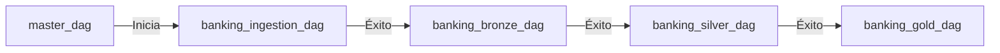

# 6. Orquestación con Airflow (Cloud Composer) - (Airflow Orchestration)

Esta sección detalla cómo coordinar, programar y monitorear todo el pipeline de datos bancarios (desde las fuentes operacionales hasta los tablones finales de BigQuery) mediante **Apache Airflow** ejecutado sobre el servicio administrado **Cloud Composer** en GCP.

---

## Estructura de DAGs y Módulos de Orquestación

El orquestador está diseñado de forma modular. Cada capa tiene su propio DAG de ejecución, coordinados por un DAG maestro:

*   **Configuración y Variables del Sistema:** [banking_config.py](../airflow/dags/banking_config.py)
*   **Creación Inicial de Tablas BigQuery:** [bq_table_ddl.py](../airflow/dags/bq_table_ddl.py)
*   **DAG de Ingestión Cloud SQL (Batch CDC):** [banking_ingestion_dag.py](../airflow/dags/banking_ingestion_dag.py)
*   **DAG de Ingestión Streaming (Pub/Sub Control):** [banking_streaming_ingestion_dag.py](../airflow/dags/banking_streaming_ingestion_dag.py)
*   **DAG de Procesamiento de Capa Bronze (Dataproc):** [banking_bronze_dag.py](../airflow/dags/banking_bronze_dag.py)
*   **DAG de Transformación Capa Silver (BigQuery SQL):** [banking_silver_dag.py](../airflow/dags/banking_silver_dag.py)
*   **DAG de Transformación Capa Gold (BigQuery SQL):** [banking_gold_dag.py](../airflow/dags/banking_gold_dag.py)
*   **DAG Maestro Coordinador (Master DAG):** [master_dag.py](../airflow/dags/master_dag.py)

---

## 1. Diseño de Arquitectura Desacoplada (Configuración)

Para evitar escribir código rígido (*hardcoded*), la parametrización de las conexiones, variables de entorno y buckets se maneja de la siguiente manera:
1.  **Airflow Variables:** Se definen variables clave del entorno en Airflow (como `banking_env`, `banking_project_id`, `banking_cdc_raw_base`, etc.).
2.  **Módulo Configuración:** `banking_config.py` lee estas variables, les asigna valores por defecto si no existen y expone un objeto de configuración unificado para todos los DAGs.

---

## 2. Flujo Secuencial del DAG Maestro (Master DAG)

El archivo `master_dag.py` actúa como el coordinador general del Data Lake, implementando un flujo de dependencias lineales mediante operadores de disparo de sub-DAGs (`TriggerDagRunOperator`):

### Detalle de Ejecución por Capa:

1.  **`banking_ingestion_dag`:** Dispara los trabajos de Cloud Dataflow para leer los incrementales (CDC) de Cloud SQL MySQL y depositarlos como Parquet en GCS.
2.  **`banking_bronze_dag`:** Ejecuta un clúster temporal de Cloud Dataproc, corre el job Spark (`bronze_gcs_to_bq.py`) para estructurar los archivos Parquet en las tablas Bronze de BigQuery, realiza auditorías en `ingestion_audit_log` y actualiza la marca de agua en `cdc_config`.
3.  **`banking_silver_dag`:** Ejecuta los scripts SQL (`dim_customer.sql`, `dim_account.sql`, `fact_transactions.sql`) en BigQuery aplicando reglas de calidad de datos, unificación de fuentes, control de nulos y versionamiento histórico SCD Tipo 2.
4.  **`banking_gold_dag`:** Ejecuta los tablones agregados y consolida KPIs de analítica de negocio.

---

## 3. Monitoreo y Tolerancia a Fallos

El framework de orquestación implementa:
*   **Políticas de Reintento:** Cada tarea en los DAGs está configurada con políticas automáticas de reintento (`retries = 1`) y tiempos de espera (`retry_delay`).
*   **Alertas por Correo:** Integración automática en los parámetros de ejecución (`mail_responsables`) para notificar directamente a los ingenieros de datos ante cualquier fallo o detención de los pipelines en producción.
